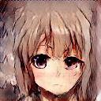
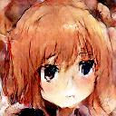

# Japanese anime style portrait generator

Dataset: [Anime GAN Lite | Kaggle](https://www.kaggle.com/datasets/prasoonkottarathil/gananime-lite)

I manually delete the desktop.ini file

this project is a simple implementation of DC-GAN to generate pictures by random noise.

## Sample output

## How to use this model

1. configurate the model you want to use in the `config.py`
2. run `generage.py`  or `python generate.py` in the terminal

## How to train your own model

1. put the dataset you want to generate under `./data` folder.
2. configurate the `config.py` change the argument `--dataset` to your own dataset path
3. run `train.py` or `python train.py` in the terminal

> :warning:Note: since normalization operation included, the color style between generate pic and original pic may not same.

## Knowing issues :bug:

- The output of the discriminator can be optimized, may improve the networks performance
- It still has mode collapse problems in given model. I will fix it later.